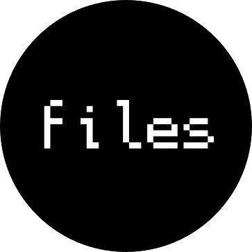

<!-- ANCHOR: header -->

# dotfiles

  

My dotfiles for NixOS and the Nix package manager, written in literate programming.

<!-- ANCHOR_END: header -->

View the [HTML version](https://dpdmancul.gitlab.io/dotfiles).

See [table of contents](./src/SUMMARY.md).

<!-- ANCHOR: content -->

Download [tangled dotfiles](https://gitlab.com/DPDmancul/dotfiles/-/tree/nix/flake).

# Usage

1. Clone the repo <https://gitlab.com/DPDmancul/dotfiles.git>
2. Optionally run `nix-shell` to get all the required dependencies into the environment
3. Just run `make` to update all dotfiles;
   `make doc` will generate the HTML for these dotfiles.

**Warning** read the dotfiles before apply them!

## Without tangling

Download [tangled dotfiles](https://gitlab.com/DPDmancul/dotfiles/-/tree/flake) and follow the instructions.

<!-- ANCHOR_END: content -->

